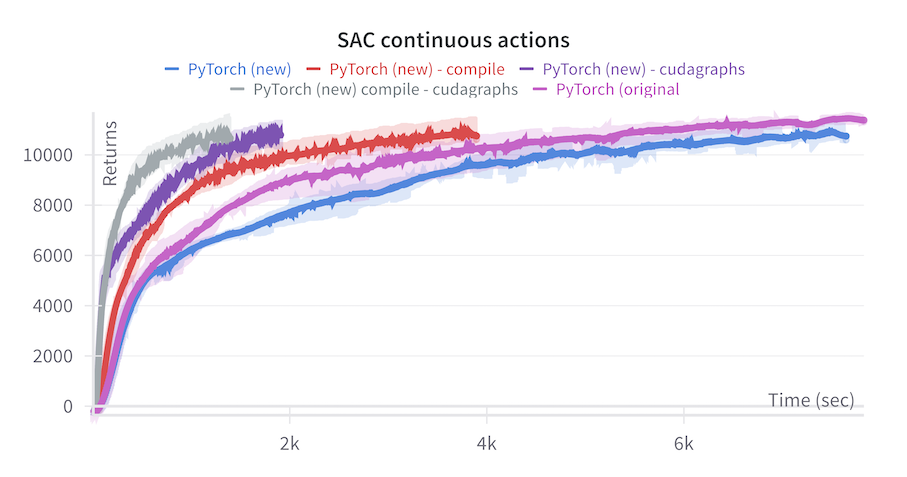
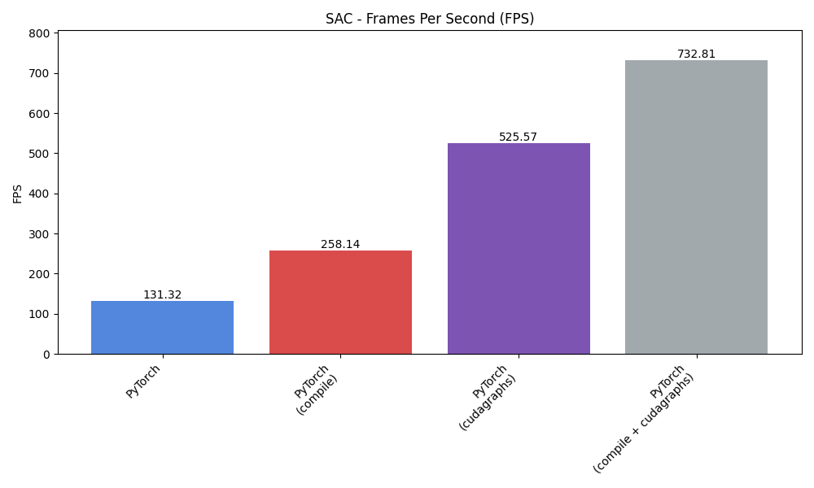
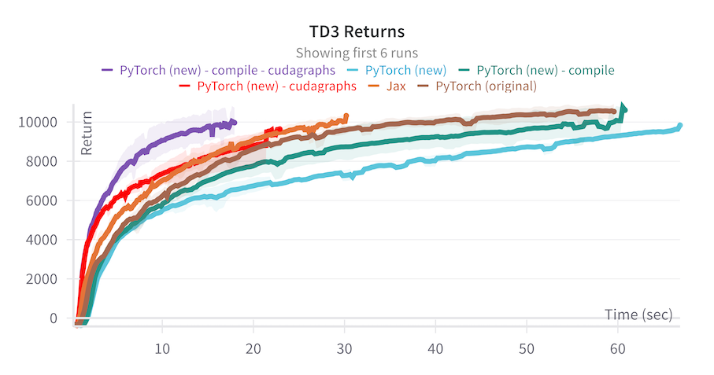
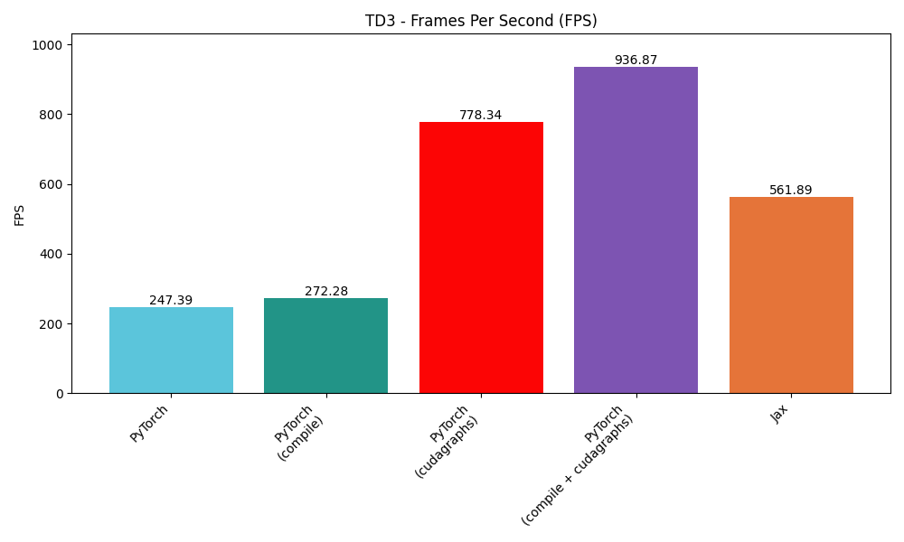
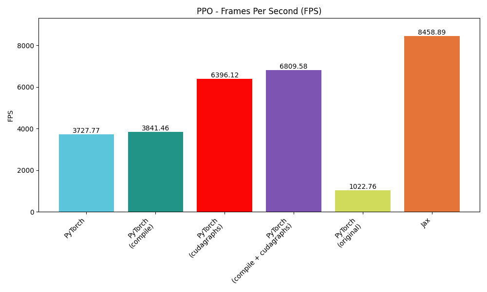
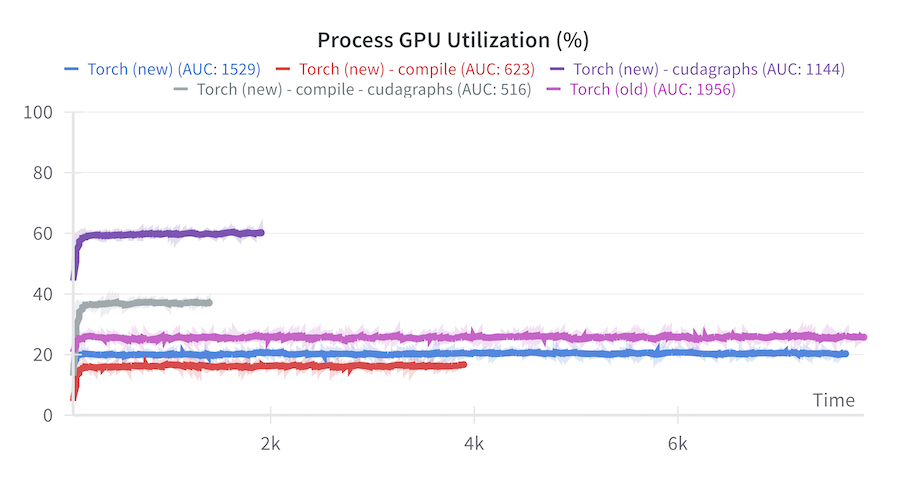

# LeanRL - Turbo-implementations of CleanRL scripts 

LeanRL is a lightweight library consisting of single-file, pytorch-based implementations of popular Reinforcement
Learning (RL) algorithms.
The primary goal of this library is to inform the RL PyTorch user base of optimization tricks to cut training time by
half or more.

More precisely, LeanRL is a fork of CleanRL, where hand-picked scripts have been re-written using PyTorch 2 features,
mainly [`torch.compile`](https://pytorch.org/tutorials/intermediate/torch_compile_tutorial.html) and
[`cudagraphs`](https://pytorch.org/blog/accelerating-pytorch-with-cuda-graphs/).
The goal is to provide guidance on how to run your RL script at full speed with minimal impact on the user experience.

## Key Features:

* 📜 Single-file implementation
   * We stick to the original spirit of CleanRL which is to keep *every detail about an algorithm variant in a single standalone file.* 
* 🚀 Fast implementations:
  * We provide an optimized, lean version of the PyTorch scripts (`<script_name>_torchcompile.py`) where data copies
    and code execution have been optimized thanks to four tools: 
    * 🖥️ `torch.compile` to reduce the overhead and fuse operators whenever possible;
    * 📈 `cudagraphs` to isolate all the cuda operations and eliminate the cost of entering the compiled code;
    * 📖 `tensordict` to speed-up and clarify data copies on CUDA, facilitate functional calls and fast target parameters updates.
    * 🗺️ `torch.vmap` to vectorize the execution of the Q-value networks, when needed.
  * We provide a somewhat lighter version of each script, removing some logging and checkpointing-related lines of code.
    to focus on the time spent optimizing the models.
  * If available, we do the same with the Jax version of the code.
* 🪛 Local Reproducibility via Seeding

**Disclaimer**: This repo is a highly simplified version of CleanRL that lacks many features such as detailed logging
or checkpointing - its only purpose is to provide various versions of similar training scripts to measure the plain
runtime under various constraints. However, we welcome contributions that re-implement these features.

## Speed-ups

There are three sources of speed-ups in the codes proposed here:

- **torch.compile**: Introduced in PyTorch 2.0, `torch.compile` serves as the primary framework for accelerating the
  execution of PyTorch code during both training and inference phases. This compiler translates Python code into a
  series of elementary operations and identifies opportunities for fusion. A significant advantage of `torch.compile` is
  its ability to minimize the overhead of transitioning between the Python interpreter and the C++ runtime.
  Unlike PyTorch's eager execution mode, which requires numerous such boundary crossings, `torch.compile` generates a
  single C++ executable, thereby minimizing the need to frequently revert to Python. Additionally, `torch.compile` is
  notably resilient to graph breaks, which occur when an operation is not supported by the compiler (due to design
  constraints or pending integration of the Python operator). This robustness ensures that virtually any Python code can
  be compiled in principle.
- **cudagraphs**: Reinforcement Learning (RL) is typically constrained by significant CPU overhead. Unlike other machine
  learning domains where networks might be deep, RL commonly employs shallower networks. When using `torch.compile`,
  there is a minor CPU overhead associated with the execution of compiled code itself (e.g., guard checks).
  This overhead can negate the benefits of operator fusions, especially since the functions being compiled are already
  quick to execute. To address this, PyTorch offers cudagraph support. Utilizing cudagraphs involves capturing the operations
  executed on a CUDA device, using device buffers, and replaying the same operations graph later. If the graph's buffers
  (content) are updated in-place, new results can be generated. Here is how a typical cudagraph pipeline appears:

  ```python
  g = torch.cuda.CUDAGraph()
  with torch.cuda.graph(graph):
       # x_buffer, y_buffer are example tensors of the desired shape
       z_buffer = func(x_buffer, y_buffer)
  # later on, with a new x and y we want to pass to func
  x_buffer.copy_(x)
  y_buffer.copy_(y)
  graph.replay()
  z = z_buffer.clone()
  ```

  This has some strong requirements (all tensors must be on CUDA, and dynamic shapes are not supported).
  Because we are explicitly avoiding the `torch.compile` entry cost, this is much faster. Cudagraphs can also be used
  without `torch.compile`, but by using both simultaneously we can benefit from both operator fusion and cudagraphs
  speed-ups.
  As one can see, using cudagraph as such is a bit convoluted and not very pythonic. Fortunately, the `tensordict`
  library provides a `CudaGraphModule` that acts as a wrapper around an `nn.Module` and allows for a flexible and safe
  usage of `CudaGraphModule`.

**To reproduce these results in your own code base**: look for calls to `torch.compile` and `CudaGraphModule` wrapper
within the `*_torchcompile.py` scripts.

The following table displays speed-ups obtained on a H100 equipped node with TODO cpu cores.
All models were executed on GPU, simulation was done on CPU.

<table>
  <tr>
   <td><strong>Algorithm</strong>
   </td>
   <td><strong>PyTorch speed (fps) - CleanRL implementation</strong>
   </td>
   <td><strong>PyTorch speed (fps) - LeanRL implementation</strong>
   </td>
   <td><strong>PyTorch speed (fps) - compile</strong>
   </td>
   <td><strong>PyTorch speed (fps) - compile+cudagraphs</strong>
   </td>
   <td><strong>Overall speed-up</strong>
   </td>
  </tr>
   <td><a href="leanrl/ppo_atari_envpool_torchcompile.py">PPO (Atari)</a>
   </td>
   <td> 1022
   </td>
   <td> 3728
   </td>
   <td> 3841
   </td>
   <td> 6809
   </td>
   <td> 6.8x
   </td>
  </tr>
   <td><a href="leanrl/ppo_continuous_action_torchcompile.py">PPO (Continuous action)</a>
   </td>
   <td> 652
   </td>
   <td> 683
   </td>
   <td> 908
   </td>
   <td> 1774
   </td>
   <td> 2.7x
   </td>
  </tr>
   <td><a href="leanrl/sac_continuous_action_torchcompile.py">SAC (Continuous action)</a>
   </td>
   <td> 127
   </td>
   <td> 130
   </td>
   <td> 255
   </td>
   <td> 725
   </td>
   <td> 5.7x
   </td>
  </tr>
   <td><a href="leanrl/td3_continuous_action_torchcompile.py">TD3 (Continuous action)</a>
   </td>
   <td> 272
   </td>
   <td> 247
   </td>
   <td> 272
   </td>
   <td> 936
   </td>
   <td> 3.4x
   </td>
  </tr>
</table>

These figures are displayed in the plots below. All runs were executed for an identical number of steps across 3
different seeds.
Fluctuations in the results are due to seeding artifacts, not implementations details (which are identical across
scripts).

<details>
  <summary>SAC (HalfCheetah-v4)</summary>

  

  

</details>

<details>
  <summary>TD3 (HalfCheetah-v4)</summary>

  

  

</details>

<details>
  <summary>PPO (Atari - Breakout-v5)</summary>

  

  

</details>

### GPU utilization

Using `torch.compile` and cudagraphs also makes a better use of your GPU.
To show this, we plot the GPU utilization throughout training for SAC. The Area Under The Curve (AUC)
measures the total usage of the GPU over the course of the training loop execution.
As this plot show, the combined usage of compile and cudagraphs brings the GPU utilization to its minimum value,
meaning that you can train more models in a shorter time by utilizing these features together.



### Tips to accelerate your code in eager mode

There may be multiple reasons your RL code is running slower than it should.
Here are some off-the-shelf tips to get a better runtime:

 - Don't send tensors to device using `to(device)` if you can instantiate them directly there. For instance,
   prefer `randn((), device=device)` to `randn(()).to(device)`.
 - Avoid pinning memory in your code unless you thoroughly tested that it accelerates runtime (see 
   [this tutorial](https://pytorch.org/tutorials/intermediate/pinmem_nonblock.html) for more info).
 - Avoid calling `tensor.item()` in between cuda operations.
   This triggers a cuda synchronization and blocks
   your code. Do the logging after all code (forward / backward / optim) has completed.
   See how to find sync points
   [here](https://pytorch.org/docs/stable/generated/torch.cuda.set_sync_debug_mode.html#torch-cuda-set-sync-debug-mode))
 - Avoid frequent calls to `eval()` or `train()` in eager mode.
 - Avoid calling `args.attribute` often in the code, especially with [Hydra](https://hydra.cc/docs/). Instead, cache
   the args values in your script as global workspace variables.
 - In general, in-place operations are not preferable to regular ones. Don't load your code with `mul_`, `add_` if not
   absolutely necessary.

## Get started

Unlike CleanRL, LeanRL does not currently support `poetry`.

Prerequisites:
* Clone the repo locally:
  ```bash
  git clone https://github.com/pytorch-labs/leanrl.git && cd leanrl
  ```
* Python >=3.7.1,<3.11
- `pip install -r requirements/requirements.txt` for basic requirements, or another `.txt` file for specific applications.
- Upgrade torch to its nightly builds for a better coverage of `torch.compile`:
  - CUDA 11.8: `pip3 install --pre torch --index-url https://download.pytorch.org/whl/nightly/cu118`
  - CUDA 12.1: `pip3 install --pre torch --index-url https://download.pytorch.org/whl/nightly/cu121`
  - CUDA 12.4: `pip3 install --pre torch --index-url https://download.pytorch.org/whl/nightly/cu124`
  - CPU: `pip3 install --pre torch --index-url https://download.pytorch.org/whl/nightly/cpu`

Once the dependencies have been installed, run the scripts as follows

```bash
python leanrl/ppo_atari_torchcompile.py \
    --seed 1 \
    --total-timesteps 50000 \
    --compile \
    --cudagraphs
```

## Citing CleanRL

LeanRL does not have a citation yet, credentials should be given to CleanRL instead.
To cite CleanRL in your work, please cite our technical [paper](https://www.jmlr.org/papers/v23/21-1342.html):

```bibtex
@article{huang2022cleanrl,
  author  = {Shengyi Huang and Rousslan Fernand Julien Dossa and Chang Ye and Jeff Braga and Dipam Chakraborty and Kinal Mehta and João G.M. Araújo},
  title   = {CleanRL: High-quality Single-file Implementations of Deep Reinforcement Learning Algorithms},
  journal = {Journal of Machine Learning Research},
  year    = {2022},
  volume  = {23},
  number  = {274},
  pages   = {1--18},
  url     = {http://jmlr.org/papers/v23/21-1342.html}
}
```


## Acknowledgement

LeanRL is forked from [CleanRL](https://github.com/vwxyzjn/cleanrl).

CleanRL is a community-powered by project and our contributors run experiments on a variety of hardware.

* We thank many contributors for using their own computers to run experiments
* We thank Google's [TPU research cloud](https://sites.research.google/trc/about/) for providing TPU resources.
* We thank [Hugging Face](https://huggingface.co/)'s cluster for providing GPU resources. 

## License
LeanRL is MIT licensed, as found in the LICENSE file.
